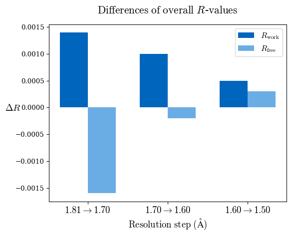
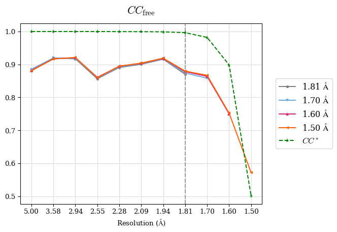

.. pairef documentation master file, created by
   sphinx-quickstart on Wed Jan 16 12:09:59 2019.
   You can adapt this file completely to your liking, but it should at least
   contain the root `toctree` directive.

*PAIREF* - Documentation
========================

.. toctree::
   :maxdepth: 1
   :caption: Contents:

   installation
   using
   gui
   list_of_functions
   test
   credits

*PAIREF* is a tool for macromolecular crystallographers that performs the *PAIRed REFinement protocol* [1]_ automatically to estimate the optimal high-resolution cutoff. It is developed in Python and can be installed as a module into the `Computational Crystallography Toolbox <https://cci.lbl.gov/cctbx_docs/index.html>`_. It provides graphical and command-line interface that executes all the needed calculations. Parameters of refinement can be specified in detail to put all the calculations under full control of the user. Obtained results are presented as plots and tables in HTML log file. *PAIREF* supports `REFMAC5 <http://www.ccp4.ac.uk/html/refmac5.html>`_ (part of the `CCP4 Software Suite <http://www.ccp4.ac.uk/>`_) and `phenix.refine <https://www.phenix-online.org/documentation/reference/refinement.html>`_ (part of the `PHENIX <https://www.phenix-online.org/documentation/reference/refinement.html>`_) for structure model refinement.

.. [1] `P.A. Karplus, K. Diederichs: "Linking crystallographic model and data quality." (2012) Science, 336(6084):1030-3. <https://www.ncbi.nlm.nih.gov/pmc/articles/PMC3457925/>`_

Examples of resulting graphs:

Please refer: M. Maly, K. Diederichs, J. Dohnalek, P. Kolenko: `Paired refinement under the control of PAIREF <https://journals.iucr.org/m/issues/2020/04/00/mf5044/index.html>`_ (2020) *IUCrJ* **7**. *PAIREF* is developed by Martin Malý in collaboration of Czech Technical University, Czech Academy of Sciences, and University of Konstanz. For further information, see :ref:`credits-label`.

Getting started
===============

*PAIREF* depends on the `CCP4 Software Suite <http://www.ccp4.ac.uk/>`_ or `PHENIX <https://www.phenix-online.org>`_. Both contain the `Computational Crystallography Toolbox <https://cci.lbl.gov/cctbx_docs/index.html>`_ with Python. *PAIREF* works with both Python 2 and Python 3.

*PAIREF* can be easily installed running command :code:`cctbx.python -m pip install pairef --user --no-deps` in the terminal (GNU/Linux, macOS) or CCP4Console (Windows) or Phenix Command Prompt (Windows). Full instructions are described on the page :ref:`installation-label`. 

How to use the *PAIREF* is described on the page :ref:`using-label`. To run paired refinement of a model (previously refined at 1.81 Å) for a series of cutoffs (1.7, 1.6, and 1.5 Å), execute a following command:

.. code ::

   cctbx.python -m pairef --XYZIN model_1-81A.pdb --HKLIN data_1-5A.mtz --HKLIN_UNMERGED data_1-5A_unmerged.mtz -i 1.81 -r 1.7,1.6,1.5
