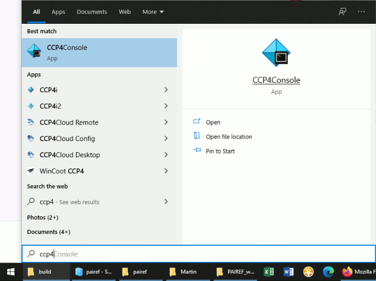
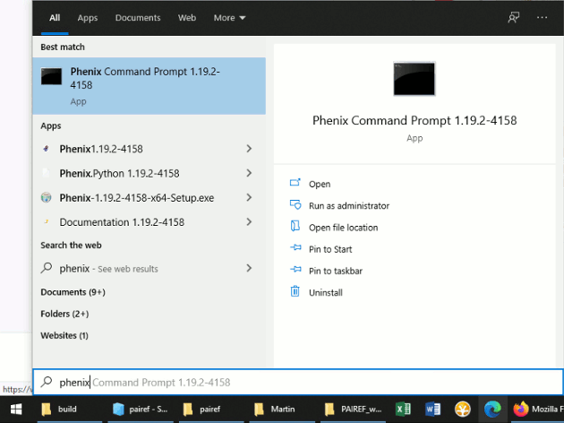

.. _installation-label:

Installation
============

System requirements
-------------------

*PAIREF* is a multiplatform Python module and works on GNU/Linux, Windows and macOS. *PAIREF* depends on the `CCP4 Software Suite <http://www.ccp4.ac.uk>`_ or `PHENIX <https://www.phenix-online.org>`_. Both contain the `Computational Crystallography Toolbox <https://cci.lbl.gov/cctbx_docs/index.html>`_ with Python. *PAIREF* works with both Python 2 and Python 3.

Installation
------------

Installation can be done easily using *pip* that is usually distributed in CCTBX with Python. If not, see the :ref:`trouble-label` section below. In GNU/Linux or macOS, just open the `terminal <https://en.wikipedia.org/wiki/Terminal_emulator>`_. In Windows, find the CCP4 console or Phenix Command Prompt in the Start menu and open it (see the screenshots below).

Now execute the following commands that installs *PAIREF* on your computer:

.. code ::

   cctbx.python -m ensurepip --user
   cctbx.python -m pip install pairef --no-deps --upgrade --user

Be sure that you have used the command `cctbx.python` or `ccp4-python` instead of `python`. macOS users should also have a look to this section below: :ref:`troubleccp4-label`.

If you have administrator permissions, it is possible to install *PAIREF* for all the users. Just skip the option :code:`--user`:

.. code ::

   cctbx.python -m ensurepip
   cctbx.python -m pip install pairef --no-deps --upgrade

.. note::
   If you have installed *PAIREF* as root or you added the user site-packages directory in your shell *PATH*, you will not need to write the whole :code:`cctbx.python -m pairef ARGUMENTS` but only :code:`pairef ARGUMENTS`.

Packages are also available at the `PyPI <https://pypi.org/project/pairef/>`_ repository.

.. _technicals-label:

Technical details of installation
:::::::::::::::::::::::::::::::::

The installation is done with *pip*, the package installer for Python. When the option :code:`--user` is used, the *PAIREF* module is installed *User Space* (see the `pip documentation <https://pip.pypa.io/en/stable/user_guide/#user-installs>`_). That means that the module is usually installed to folder ~/.local/lib/pythonX.X/site-packages/ (Linux) or :code:`C:\Users\user\AppData\` (Windows) so the root/administrator permissions are not required.

If the installation command is run without the option :code:`--user`, the module is installed just into the *CCP4* and *PHENIX* folders. So it should be installed separately for both *CCP4* and *PHENIX* and the root/administrator permissions are usually required. *CCP4* example: While using /software/ccp4/ccp4-7.1/bin/cctbx.python or /software/ccp4/ccp4-7.1/bin/ccp4-python for the installation command, the module would be installed to /software/ccp4/ccp4-7.1/lib/python2.7/site-packages/ or /software/ccp4/ccp4-7.1/lib/python3.7/site-packages/ . *PHENIX* example: While using /software/phenix/phenix-1.19-4092/build/bin/cctbx.python for the installation command, the module would be installed to /software/phenix/phenix-1.19-4092/conda_base/lib/python2.7/site-packages/ or /software/phenix/phenix-1.19-4092/conda_base/lib/python3.7/site-packages/ . So be sure which :code:`cctbx.python` you are using in your shell - you can check it with the command :code:`which cctbx.python` on Linux. 

Moreover, if you installed the module as root/administrator, it can happen that a user got ther error message :code:`pythonX.X: No module named pairef`. This depends on your `umask setting <https://stackoverflow.com/questions/11161776/pip-inconsistent-permissions-issues>`_. In this case, please set the umask properly that the other users can read the content newly created during the installation or change manually the permissions for the directory where the module was installed.

.. _trouble-label:

Troubleshooting
---------------

.. _troubleccp4-label:

PAIREF works with PHENIX but not with CCP4 including PAIREF GUI
:::::::::::::::::::::::::::::::::::::::::::::::::::::::::::::::

If you noticed that *PAIREF* does not work with *CCP4* (typically on macOS) or you got the error :code:`No module named pairef` while launching PAIREF GUI via :code:`ccp4-python -m pairef --gui`, execute also these commands (using `ccp4-python` instead of `cctbx.python`) to be sure that the installation has been done properly also for *CCP4*:

.. code ::

   ccp4-python -m ensurepip --user
   ccp4-python -m pip install pairef --no-deps --upgrade --user

Command prompt freezes on Windows
:::::::::::::::::::::::::::::::::

"*PAIREF or its installation just hangs in the command prompt. Nothing is going on.*"

This can unfortunately happen suddenly on MS Windows. It is caused by the `Quick Edit Mode of the Command Prompt <https://social.msdn.microsoft.com/Forums/en-US/bf9f97a1-ebbb-4f35-bbb6-6af740a71c76/how-to-disable-command-window-quick-edit-mode-once-and-for-all?forum=vcgeneral>`_. Press Enter or click in the prompt window, the process will continue running.

Error: No module *pip* available
::::::::::::::::::::::::::::::::

To install *pip* in this case, we can follow the `instructions in pip documentation <https://pip.pypa.io/en/stable/installing/#installing-with-get-pip-py>`_: download the installation script *get-pip.py* and run it. 

.. code ::

   wget https://bootstrap.pypa.io/3.7/get-pip.py
   ccp4-python get-pip.py

Then it should be possible to install *PAIREF* using the commands on the top of this page.

.. _paths-label:

cctbx.python: Command not found
:::::::::::::::::::::::::::::::

*PAIREF* depends on the `CCP4 Software Suite <http://www.ccp4.ac.uk/>`_ or `PHENIX <https://www.phenix-online.org>`_. The appropriate paths to the executables must be set well in your working shell (typically bash or tcsh).

If you use CCP4, according to the `documentation <http://legacy.ccp4.ac.uk/docs.php#commandline>`_, run :code:`source /path/to/ccp4-<version>/bin/ccp4.setup-sh` (in bash/dash/zsh shells) or :code:`source /path/to/ccp4-<version>/bin/ccp4.setup-csh` (in csh/tcsh shells).

If you use Phenix, according to the `documentation <https://www.phenix-online.org/documentation/install-setup-run.html#setting-up-the-command-line-environment>`_, run :code:`. /usr/local/phenix-<version>/phenix_env.sh` (in bash shell) or :code:`source /usr/local/phenix-<version>/phenix_env` (in csh/tcsh shells).

Then it should be possible to install *PAIREF* using the commands on the top of this page.

SNIMissingWarning and InsecurePlatformWarning
:::::::::::::::::::::::::::::::::::::::::::::

If you use old versions of CCP4, you may get the following error message during installation:

.. code ::

   C:\ccp4temp>ccp4-python -Qnew -m pip install pairef --user --no-deps
   Collecting pairef
   C:\CCP4-7\7.0\lib\site-packages\pip\_vendor\requests\packages\urllib3\util\ssl_.py:318:
   SNIMissingWarning: An HTTPS request has been made, but the SNI
   (Subject Name Indication) extension to TLS is not available on this
   platform. This may cause the server to present an incorrect TLS
   certificate, which can cause validation failures. You can upgrade to a
   newer version of Python to solve this. For more information, see
   https://urllib3.readthedocs.io/en/latest/security.html#snimissingwarning.
     SNIMissingWarning
   C:\CCP4-7\7.0\lib\site-packages\pip\_vendor\requests\packages\urllib3\util\ssl_.py:122:
   InsecurePlatformWarning: A true SSLContext object is not available.
   This prevents urllib3 from configuring SSL appropriately and may cause
   certain SSL connections to fail. You can upgrade to a newer version of
   Python to solve this. For more information, see
   https://urllib3.readthedocs.io/en/latest/security.html#insecureplatformwarning.
     InsecurePlatformWarning
     Could not find a version that satisfies the requirement pairef (from
   versions: )
   No matching distribution found for pairef
   C:\CCP4-7\7.0\lib\site-packages\pip\_vendor\requests\packages\urllib3\util\ssl_.py:122:
   InsecurePlatformWarning: A true SSLContext object is not available.
   This prevents urllib3 from configuring SSL appropriately and may cause
   certain SSL connections to fail. You can upgrade to a newer version of
   Python to solve this. For more information, see
   https://urllib3.readthedocs.io/en/latest/security.html#insecureplatformwarning.
     InsecurePlatformWarning

To solve this problem, install the missing dependencies using the command:

.. code ::

   cctbx.python -m pip install urllib3[secure] --user

Then it should be possible to install *PAIREF* using the commands on the top of this page.

Error: No module named pairef
:::::::::::::::::::::::::::::

Please check the section :ref:`technicals-label`.

Reinstallation and version upgrade
----------------------------------

Reinstallation and upgrade to a new version can be done also using *pip*, you can use the following command:

.. code ::

   cctbx.python -m pip install pairef --no-deps --user --upgrade --force-reinstall

If you have administrator permissions, skip the option :code:`--user`.

Uninstallation
--------------

Run command :code:`cctbx.python -m pip uninstall pairef`. If you have installed the package as system administrator, you must run this command as an administrator, too.
